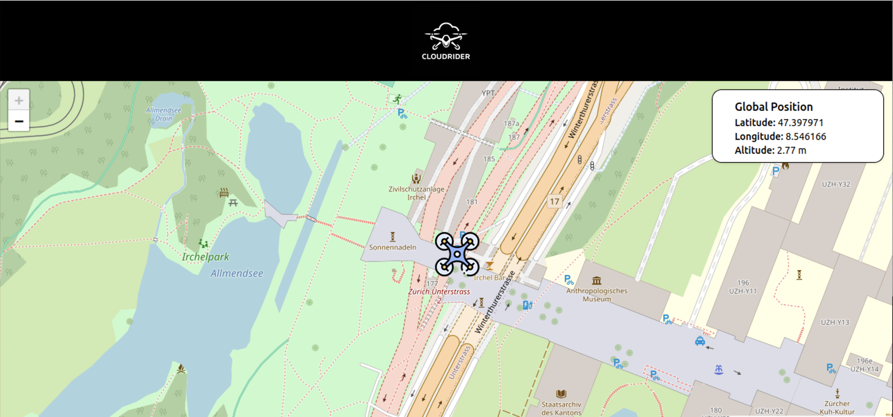
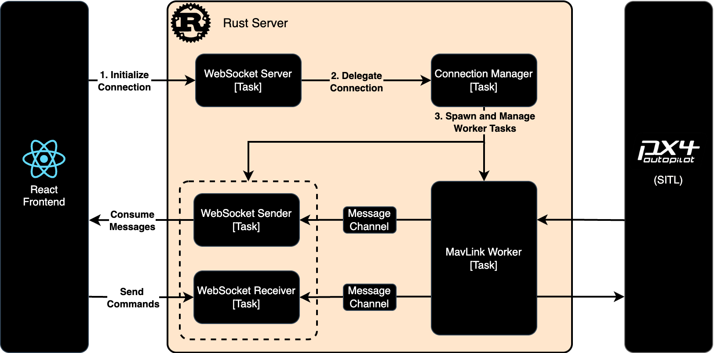

# Cloud Rider

Cloud Rider is a proof-of-concept (PoC) Ground Control Station (GCS) built with a modern tech stack:

- 🚀 Rust backend for performance and safety
- 💻 React frontend for an interactive user interface
- 🔄 WebSocket-based real-time communication between frontend and backend

It enables telemetry data and command data streaming and is compatible with MAVLink.

## Cloud Rider Frontend

## Cloud Rider Backend

## ✅ 1. Telemetry Data Reception
- [x] Simple WebSocket server written in Rust to provide telemetry data from PX4 using MAVLink protocol

## ✅ 2. Real-Time Display & Situational Awareness
- [x] Simple React frontend to consume and display telemetry data
- [x] Display drone position on a map

## 🛠️ 3. Command and Control
- [ ] Enable sending commands from the frontend

## 🛠️ 4. Mission Planning
- [ ] Advanced mission planning capabilities (e.g., creating and uploading flight paths)

## 🛠️ 5. Data Logging
- [ ] (Optional) Implement backend logging for telemetry and control data

## 🛠️ 6. Session and User Management
- [ ] Advanced session management (graceful shutdown)
- [ ] User authentication and session handling
