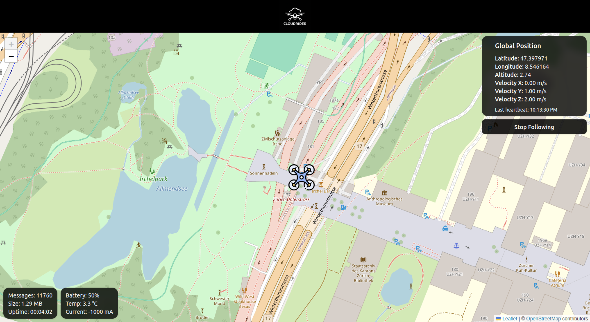

# Cloud Rider

Cloud Rider is a proof-of-concept (PoC) Ground Control Station (GCS) built with a modern tech stack:

- 🚀 Rust backend for performance, safety, and MAVLink compatibility
- 💻 React frontend for an interactive user interface
- 🔄 WebSocket-based real-time communication between frontend and backend

It enables telemetry data and command data streaming and is compatible with MAVLink.

## Cloud Rider Frontend

## Tracking Mode
https://github.com/user-attachments/assets/f2351f7e-08dd-4cff-873b-0367d40aaf09

## Non Tracking Mode
https://github.com/user-attachments/assets/ae7c5043-888e-4ae9-b674-fc50cd7d3882

## Cloud Rider Backend

## 📝 Features

### ✅ 1. Telemetry Data Reception
- [x] Simple WebSocket server written in Rust to provide telemetry data from PX4 using MAVLink protocol

### ✅ 2. Real-Time Display & Situational Awareness
- [x] Simple React frontend to consume and display telemetry data
- [x] Display drone position on a map

### 🛠️ 3. Command and Control
- [ ] Enable sending commands from the frontend

### 🛠️ 4. Mission Planning
- [ ] Advanced mission planning capabilities (e.g., creating and uploading flight paths)

### 🛠️ 5. Data Logging
- [ ] (Optional) Implement backend logging for telemetry and control data

### 🛠️ 6. Session and User Management
- [ ] Advanced session management (graceful shutdown)
- [ ] User authentication and session handling
